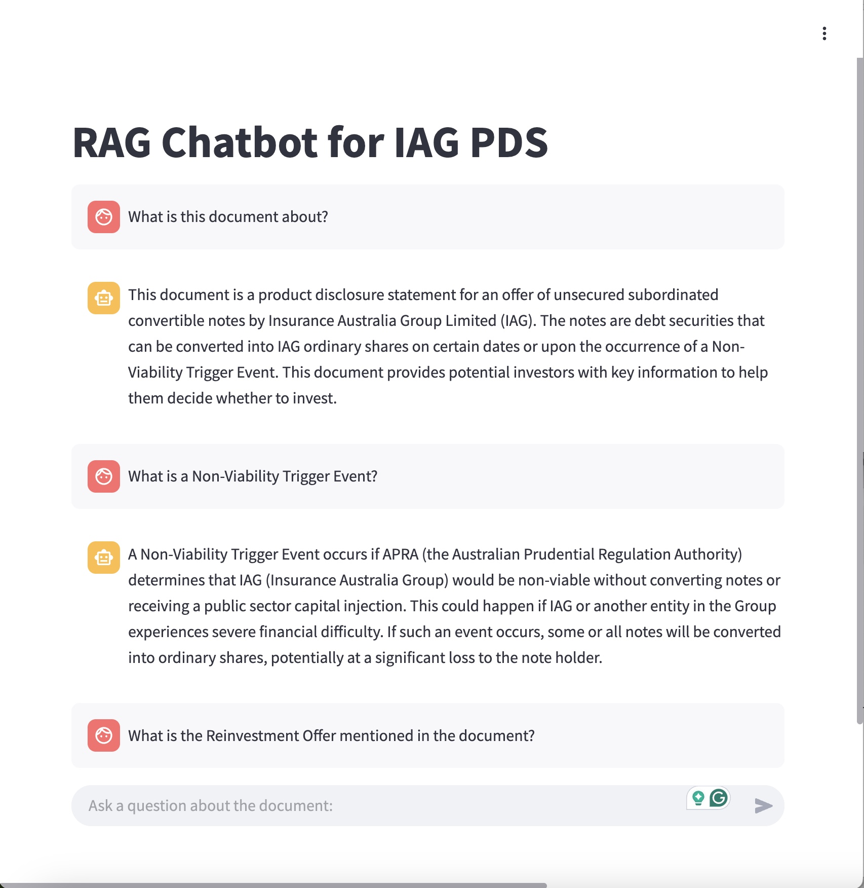

# PDS-Helper
Welcome to **IAG RAG Chatbot!** This application is designed to provide **intelligent document-based question answering** using **Retrieval-Augmented Generation (RAG)**. It allows users to interact with an AI assistant that can retrieve and generate responses based on the contents of a document.

The chatbot is powered by **Google Generative AI (Gemini)** and **FAISS vector search**, making it an efficient tool for retrieving relevant information from a given document and providing **concise, accurate responses**.



---

## Table of Contents
1. [Overview](#overview)
2. [Key Features](#key-features)
3. [Setup & Installation](#setup--installation)
4. [How It Works](#how-it-works)
5. [Contributing](#contributing)
6. [License](#license)

---

## Overview

### Why this project?  
Organizations and individuals often need **quick and reliable access to key information** from large documents. Instead of manually searching through pages, this chatbot allows users to **ask questions in natural language** and receive **contextually relevant answers** from the document.

This tool is particularly useful for:
- **Legal documents** (e.g., insurance policies, contracts, terms & conditions).
- **Technical manuals** where users need quick guidance.
- **Business reports** that require rapid retrieval of insights.

The chatbot is built using **LangChain**, **FAISS**, and **Google Generative AI (Gemini)**, ensuring high-quality retrieval and response generation.

---

## Key Features

1. **Conversational Q&A with RAG**  
   - Allows users to ask **natural language** questions about the document.
   - Retrieves **relevant passages** from the document and generates an informed answer.

2. **Efficient Document Processing**  
   - Uses **LangChain’s PyPDFLoader** to extract text from PDFs.
   - Splits large documents into manageable chunks for improved retrieval.

3. **State-of-the-Art Vector Search**  
   - Uses **FAISS (Facebook AI Similarity Search)** to efficiently store and retrieve document chunks.
   - Embeddings are generated using **Google Generative AI’s embedding model**.

4. **Interactive Chat Experience**  
   - Chat history is maintained throughout the session.
   - Supports multi-turn interactions with the AI assistant.

5. **Error Handling & Robust Execution**  
   - Handles document loading errors and API failures gracefully.
   - Displays clear error messages to the user if something goes wrong.

---

## Setup & Installation

### Prerequisites  
Ensure you have the following installed:
- **Python 3.8+**
- **pip (Python package manager)**

### Install Dependencies  
Clone this repository and navigate into the project directory:

```bash
git clone https://github.com/your-repo/IAG-RAG-Chatbot.git
cd IAG-RAG-Chatbot
```

---

## Set Up Environment Variables
The application relies on API keys for Google Generative AI. You can set up your API key using a .env file:

```bash
Copy
Edit
echo "GOOGLE_API_KEY=your_google_api_key_here" > .env
```

---

## How It Works
### Document Loading & Preprocessing
The chatbot loads a PDF (iag_pds.pdf) using PyPDFLoader.
The document is split into smaller chunks using RecursiveCharacterTextSplitter.

### Embedding & Vector Search
Each document chunk is converted into vector embeddings using Google Generative AI’s embedding model.
These embeddings are stored in a FAISS vector database for efficient retrieval.

### Retrieval-Augmented Generation (RAG)
When a user asks a question, the chatbot:
Retrieves the most relevant document chunks from FAISS.
Uses Google’s Gemini model to generate a response based on the retrieved context.

### Chat Interface
Built using Streamlit, the chatbot provides an interactive Q&A experience.
Responses are displayed in a chat-style UI, and previous interactions are stored in the session.

---

## Contributing

We welcome contributions from the community!  
- **Bug Reports & Feature Requests**: Open an issue on GitHub.  
- **Pull Requests**: Fork the repository, create a new branch, and submit a pull request with your proposed changes.

---

## License

This project is licensed under the [MIT License](LICENSE).  
Feel free to modify and distribute the app in accordance with this license.

---

**Thank you for exploring PDS-Helper!**  

If you have any questions or feedback, please open an issue on GitHub or reach out to the project maintainers. Happy learning!